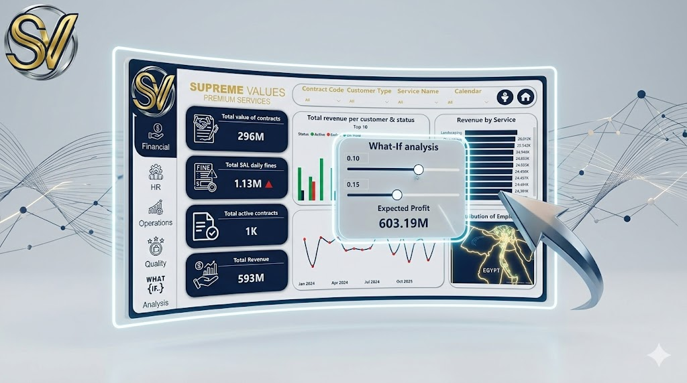

# 📊 Supreme Values: Advanced Services Performance & What-If Analysis Dashboard

## 🔍 Overview
A comprehensive, enterprise-grade Power BI analytical ecosystem designed to monitor and optimize multi-departmental performance. The project bridges the gap between raw operational data and high-level executive decision-making, featuring an interactive consultative "What-If" simulation layer.

---

## 🚀 Live Interactive Dashboard
You can interact with the live dashboard and test its functionality here:
👉 **[Launch Live Power BI Dashboard](https://app.powerbi.com/view?r=eyJrIjoiYTg3Nzc1MWYtNWEwYS00YjFiLWFlZDItZjlhNjkxZWNmOGMzIiwidCI6ImZjMWEzYzBhLWM1OWUtNDM5MC04OWRmLWUzY2I1ZTljNDVhMCJ9)**

---

## 🖼️ Dashboard Preview

---

## 🛠️ Key Features & Technical Deliverables

### 1. Data Engineering Pipeline (Data Cleaning & ETL)
* **Power Query Automation:** Extracted and transformed massive, unstructured operational log files into clean, analysis-ready datasets.
* **Data Integrity Enforcement:** Standardized financial and chronological fields by strict Data Types alignment, while eliminating missing values and duplicate rows.
* **Custom Calendar Component:** Engineered a dedicated `Calendar Table` to ensure flawless time-intelligence logic and synchronized trend behavior.

### 2. Advanced Data Modeling
* **Star Schema Architecture:** Separated high-volume transaction registries (`Fact Tables` for Revenue, Complaints, and Contracts) from core descriptive dimensions (`Dim Tables` for Employees, Contracts, and Locations) to maximize cross-filtering responsiveness.

### 3. Analytics & DAX Measures
* **Dynamic KPIs:** Formulated dozens of complex DAX measures to track real-time contractual valuation, active contract rates, wage averages, SLA performance metrics, and shift utilization patterns.

---

## 📐 Dashboard Structure & Insights

* **Financial Analysis:** Monitors a total contract value of **"296M"**, auditing daily SLA penalties to mitigate revenue leakage and boost cash flow.
* **HR Analytics:** Tracks over **5,000+ employees**, analyzing wage distribution and attrition rates, mapped geographically across Egypt.
* **Operations & Quality:** Evaluates operational efficiency by contrasting morning/evening shift productivity across branches. Integrates a dedicated customer satisfaction view categorizing complaints by severity (Critical, High, Medium, Low) and tracking resolution time.
* **What-If Analysis Engine:** A dynamic strategic simulator allowing executive leadership to test financial and operational hypotheses in real time, projecting net profit margins and potential savings via integrated Line Charts and KPI Cards.
